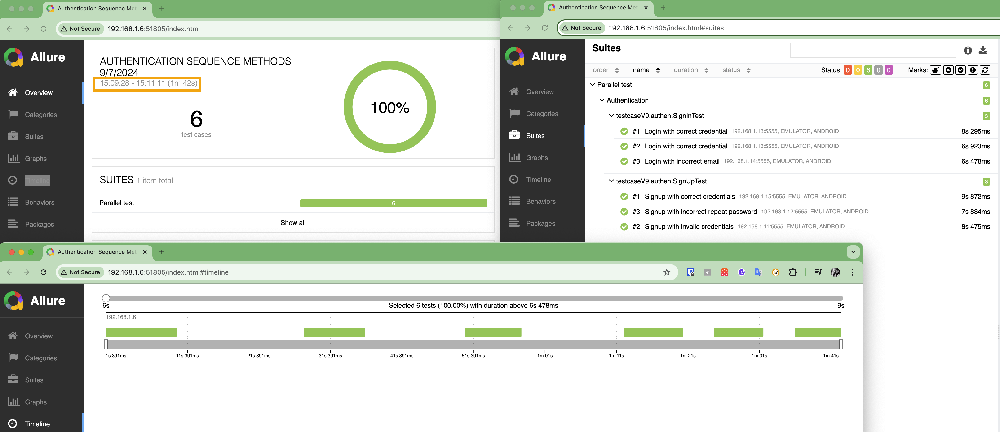
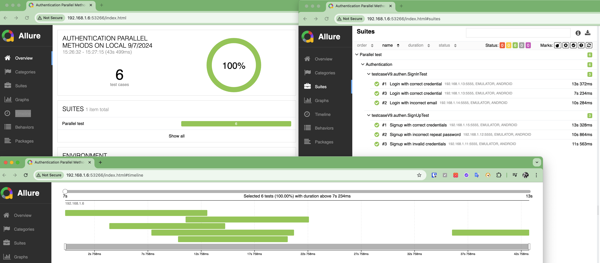
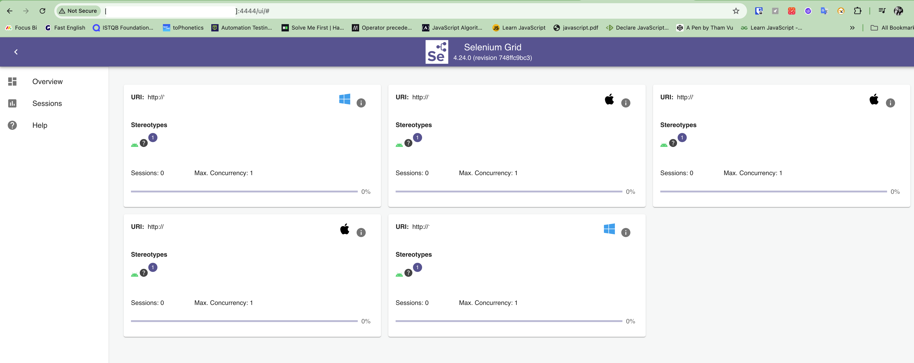
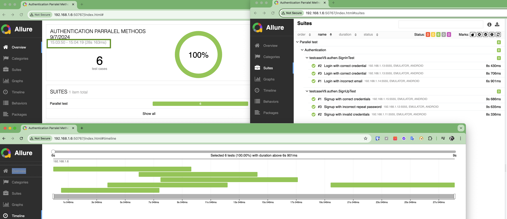

# Appium Project with Java

Learn Appium with Java

# Prerequisite setup

- Java LTS ( 17)
- Maven
- Appium 2.0 (latest)
- Appium driver ( UiAutomator2 , XCUitest)
- Appium Java Client 9.2.2 (stable)
- Appium Inspector ( get locator)
- Android SDK
- Allure
- TestNG
- IDE: IntelliJ

# Run Test

## Run on local

#### Prerequisite env

- Run appium server:
    - `appium`
- Setup devices
    - update device udid for mobile properties files on devicesOnLocal folder.
        - Ex: `deviceCapConfig/devicesOnLocal/android/mobile1.properties`

- Run sequence methods suite (total time: `1m 42s`)
    - `mvn test -Psequence-test-on-local-server -DisRemote=false`
    - 
- Run parallel methods `parallelMethodsOnSeleniumGrid.xml` suite on local (total time: `43s 499ms`)
    - `mvn test -Pparallel-methods-on-local-server -DisRemote=false`
    -  

- Run parallel classes  `parallelClassesOnSeleniumGrid.xml` suite:
    - `mvn test -Pparallel-test-on-selenium-grid -DisRemote=false`

## Run Remote ( Selenium Grid 4)

#### Prerequisite env

- Selenium Grid setup:
    - Register Nodes
    - Run Hub.
    -  

- Run parallel methods `parallelMethodsOnSeleniumGrid.xml` suite ( total time: `28s 163ms`:
    - `mvn test -Pparallel-methods-on-selenium-grid -DisRemote=true`
        - 

- Run parallel classes `parallelClassesOnSeleniumGrid.xml` suite:
    - `mvn test -Pparallel-classes-on-selenium-grid -DisRemote=true`
- Run parallel tests `parallelTestsOnSeleniumGrid.xml` suite:
    - `mvn test -Pparallel-test-on-selenium-grid -DisRemote=true`

